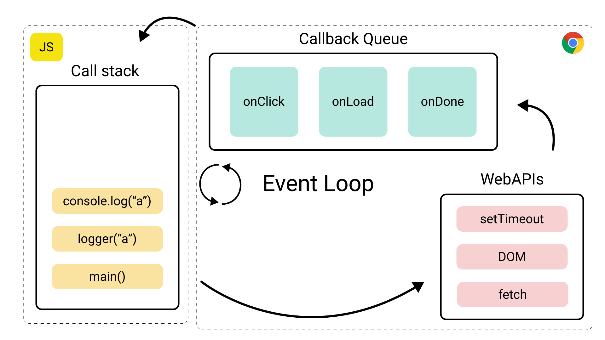

# JavaScript


Ce qu'on va voir :
- `var`, `const` ou `let` ? 🎾
- manipulations du **DOM** 🔧
- `functions` ƒ⒳
- `async`/`await` | `then`/`catch` 🕰️
- `class` / `this` 👉
- et autres joyeusetés 🥳


## `var`, `const` ou `let` ?

TLDR: don't use `var` unless you are sure you need it


### `var`
The only way to declare a variable before ES6. Rarely used now

Known as _"function scoped variable"_ or _"globally scoped variable"_


### `const`
_"block-scoped variable"_ that can't be changed through reassignment

You **must** provide a value when you declare it

```js [1-3|5|1-5]
const foo // SyntaxError: missing = in const declaration

const one = 1

one = 2 // TypeError: invalid assignment to const 'one'
```
```js [5|1-6|1-8]
// this works though
const numbers = []
numbers.push(1)
numbers.push(2)

numbers // [1, 2]

number = [3, 4] // TypeError: invalid assignment to const 'numbers'
```


### `let`
also _"block-scoped variable"_ but can be changed

You can declare it, without initializing it 

```js
let one = 1
let two

one = '1'
one // '1'

two // undefined
two = 2
two // 2
```


So what's about the scope?


```js [1-15|2,5-7|2-7,10|8-9,12-14|1-15]
function foo() {
  var x = 1
  
  if (true) {
    x = 4
    var y = 2
    const z = 3
    console.log(x) // 1
    console.log(y) // 2
  }
  
  console.log(x) // 4
  console.log(y) // 2 if bool is truthy, else undefined
  console.log(z) // ReferenceError: z is not defined
}
```


## DOM Manipulations


```html
<section id="product-list">
    <div class="product-card"
         data-product-id="1" 
         data-has-discount="false"></div>
    
    <div class="product-card on-sale"
         data-product-id="2" 
         data-has-discount="false"></div>
    
    <div class="product-card"
         data-product-id="3" 
         data-has-discount="true"></div>
</section>
```


select with id
```js
const productList = document.getElementById('product-list')
```


select with CSS selector
```js
// bad
document.querySelectorAll('#product-list .product-card')

// good, always use scope if available, it's safer
productList.querySelectorAll('.product-card')
productList.querySelectorAll('.product-card.on-sale')
```


Retrieve indirect parent element
```html
<div class="product-list">
    <div>
        <button type="button">buy</button>
    </div>
</div>
<div class="product-list">
    <div>
        <button type="button">buy</button>
    </div>
</div>
```
```js
const productListElement = button.closest('.product-list')
```


with JS
```js [1-3|1-9]
// error: filter is not a function
productList.querySelectorAll('.product-card').filter(/* ... */) 
// productLost is a NodeList. Only forEach is implemented

const productCards = Array.from(productList.querySelectorAll('.product-card'))
productCards.filter((productCard) => {
    // class name without the dot!
    return productCard.classList.contains('on-sale')
})
```


Take advantage of advance CSS selectors
```js
productList.querySelector('.product-card:last-child')

productList.querySelector('.product-card[data-product-id="2"]')
```
[MDN CSS selectors](https://developer.mozilla.org/en-US/docs/Web/CSS/CSS_selectors)

[MDN attributes selectors](https://developer.mozilla.org/en-US/docs/Web/CSS/Attribute_selectors)


### Changing style
```js
const productCard = productList.querySelector('.product-card')

productCard.style.display = 'none'

// undoing
productCard.style.display = 'block'
```
But what if it wasn't a 'block'? 😱 <!-- .element: class="fragment fade-up" data-fragment-index="1" -->

Best option is to remove property <!-- .element: class="fragment fade-up" data-fragment-index="2" -->
```js
productCard.style.removeProperty('display') // back to default
```
<!-- .element: class="fragment fade-up" data-fragment-index="2" -->

If it's important! use setProperty <!-- .element: class="fragment fade-up" data-fragment-index="3" -->
```js
productCard.style.display = 'none !important' // doesn't work

productCard.style.setProperty('display', 'none', 'important')

// works without important too instead of style.property = 'stuff'
productCard.style.setProperty('display', 'none')
```
<!-- .element: class="fragment fade-up" data-fragment-index="3" -->


### Dataset property


Easy way to retrieve infos from the DOM
```html
<div class="product-card" data-product-id="1" data-has-discount="false">
</div>
```
```js [1|3-5]
productCard = document.querySelector('.product-card')

productCard.dataset.productId // "1"

productCard.dataset.hasDiscount // "false"
```


Don't forget to cast values
```js
parseInt(productCard.dataset.productId) // 1
productCard.dataset.hasDiscount === 'true' // false
```

Or you will have bad suprises
```js
if (productCard.dataset.hasDiscount) { // string 'false' is truthy!!
    addProductWithDiscount() // happy customer ;-)
}
```


### 2 rules

1. keys are camelCased (`product-id` becomes `productId`)
2. values are **always** strings


## Functions


- [function declaration](https://developer.mozilla.org/en-US/docs/Web/JavaScript/Reference/Statements/function)
- [function expression](https://developer.mozilla.org/en-US/docs/Web/JavaScript/Reference/Operators/function)
- [arrow function expression](https://developer.mozilla.org/en-US/docs/Web/JavaScript/Reference/Functions/Arrow_functions)


### Function declaration

Creates a function and bind it to a name
```js
function aClassicFunction() {
	console.log("I hereby declare myself as a functional function!")
}
```


### Function expression
Creates an anonymous function, but without binding it to a name
```js
function() {
    console.log("an anonymous function")
}
// raises 'SyntaxError: Function statements require a function name'
```

```js
const mustBeGivenAName = function() {
    console.log("an anonymous function, but stored into a variable")
}
```


### Arrow function expression
Also an anonymous function
```js
() => console.log("lost arrow function") 
// won't raise an error, but useless this way as you can't call it
```
You must at least give it a name:
```js
const canBeGivenAName = () => console.log("My name is...")
```


```js
// one line, single argument
const double = x => x + x // implicit return

// one line, many arguments
const sum = (x, y) => x + y // implicit return

// multiline, one or many arguments
const sum = (x, y) => {
    return x + y // explicit return, because brackets are present
}
```


### When should you use arrow functions?
For very short functions
```js
const sum = (x, y) => x + y
```
or callbacks functions


iterator 
```js
[1, 2, 3].forEach(n => console.log(n * n))
// 1 
// 4
// 9
```
```js
['a', 'b', 'c'].forEach((letter, index) => {
    console.log(letter, index)
})
// 'a', 0
// 'b', 1
// 'c', 2
```
```js
const freeVariant = productVariants.find(variant => variant.price === 0)
```


Dom event
```js
document.addEventListener('click', (event) => {
    console.log('clac')
})
```


setTimeout
```js
setTimeout(() => {
    console.log(`A callback is never late. Nor is he early; 
							 it arrives precisely when it means to.`)
}, 1_000)
```
it is actually strongly advised to only use arrow functions for setTimeout and setInterval


### Function are objects!
```js
function logEventTarget(event) {
    console.log(event.target)
}

logEventTarget // no parenthesis, so it's not called 
//=> function logEventTarget(event)
logEventTarget.name // "logEventTarget"

element.addEventListener('click', logEventTarget)
```
```js
const isEven = n => n % 2 === 0
    
[1, 2, 3, 4].filter(isEven) // [2, 4]
```


### Keep it good style 🥸

[MDN style guide](https://developer.mozilla.org/en-US/docs/MDN/Writing_guidelines/Writing_style_guide/Code_style_guide/JavaScript) ❤️
[Try to code without if](https://medium.com/edge-coders/coding-tip-try-to-code-without-if-statements-d06799eed231)


### functions

it should start with a verb, sound like an action
```js
sendToCart(product)

player.start()
```

Don't be afraid a long name if necessary
```js
addProductToCartIfStillAvailable(product)
```


ensure that is does not much more than what its name suggest 

(don't make it too strict either)


if it returns a boolean it should read as an assertion
```js
isVisible(element)
isEmpty(array)
hasHiddenClass(element)
product1.cheapierThan(product2)
```


### variables


Don't add the type, use `products` instead of `productArray`


If it holds an HTML element, be explicit
```js
productsContainer
productCard
submitBtn
quantityElement // to not confuse it with `quantity` for example
```


careful with the english syntax 
```js
// wrong
idProduct
attributesCart

// good
productId
cartAttributes
````


Store absolute values in constants

```js
// be sure to be in a JS module to avoid constants leaking to global state
const COLLAPSED_CLASS_NAME = 'collapsed'

function collapse(element) {
    element.classList.add(COLLAPSED_CLASS_NAME)
}

function reveal(element) {
    element.classList.remove(COLLAPSED_CLASS_NAME)
}
```


```js
const NAVBAR_HEIGHT = 72
const BANNER_HEIGHT = 300
const HEADER_HEIGHT = NAVBAR_HEIGHT + BANNER_HEIGHT
// HEADER_HEIGHT = 372 would have work but be less explicit about why this value

document.addEventListener('scroll', (event) => {
    if (document.body.scrollTop > HEADER_HEIGHT) {
        // do stuff
    }
})
```


private variables
```js
const _loaderElement = document.querySelector('#mm_loader')
```


### DO.NOT.DO.THIS! I DARE YOU!
```js
const q = 10
element.addeventListener('input', (e) => {
    const t = e.target
    
    const p = parseInt(t.value) * q 
})
```


I DOUBLE DARE YOU


## asynchronicity 🕰️


### events
When you're adding en event listener
```js [1-6|3-5]
document.addEventListener(
    'click',
    (event) => {
        console.log('you have clicked this:', event.target)
    }
)
```


You are actually telling JS to run a **function** _when_ the **event** _occurs_ . 
<!-- .element: class="fragment fade-up" -->

Whenever it happens. 
<!-- .element: class="fragment fade-up" -->


Also, the browser is not blocked while waiting for the event to happen. 

Thankfully you can still click everywere, 
scroll, and interact with the page.


When the event occurs,

the function you passed earlier will be added, by the browser, 

to the stack of things to do (the _callback queue_),

**AFTER** it is done doing what it was doing at the moment (the _call stack_).





### fetch (HTTP request)

Let's start by an example with good ol' event listeners on

**`XmlHttpRequest`**


```js
const xhr = new XMLHttpRequest()
xhr.open('GET', 'https://example.com')

xhr.addEventListener('load', (event) => {
    console.log('successfuly loaded some stuff!')
})

xhr.addEventListener('error', event => alert('oopsy!'))

// this can go on with 'loadstart', 'loadend', 'progress' and 'abort'

xhr.send()
```


Basically, HTTP requests handling used to work like events from DOM  

We set it up, send it, and wait for the browser to call the function we provided when we receive the response.


With `fetch`, the new advised way to make HTTP requests, the need for event listeners has been replaced by Promises.

But it is quite the same idea


You can't store a promise into a variable and use right away 
```js
const result = fetch('https://example.com')
console.log(result) // Promise { <state>: "pending" }
```
You have to wait for it to complete <!-- .element: class="fragment fade-up" -->


Like XHR, you set it up, and send it (it is all within one function call now)

But instead of setting up event listeners, you tell the browser what to do next

You are telling the brower **`fetch`** this url, and **`then`** run this code with the response when it comes back


```js
fetch('https://example.com') // fetch this
    .then((response) => { // then do that
        console.log(response) // Reponse { status: 200, ok: true ... }
    })

fetch('https://example.com/this-page-does-not-exist') // fetch this
    .then((response) => { // then do that
        console.log(response) // Reponse { status: 404, ok: false ... }
    })
```


You can't know when the request will come back, so if the next actions depends on the result,
you must put it in the `then` _callback_

```js
const titleElement = document.querySelector('h1')

const promise = fetch('https://example.com')
    .then((response) => {
        titleElement.innerText = `response status is: ${response.status}`
    })

console.log(promise) // ?
console.log(document.querySelector('h1').innerText) // ?
```

```js
console.log(promise) // Promise { <state>: "pending" }
console.log(document.querySelector('h1').innerText) // Example Domain
```
<!-- .element: class="fragment fade-up" data-fragment-index="1" -->

wait just a little bit and ... <!-- .element: class="fragment fade-up" data-fragment-index="2" -->
```js
console.log(promise) // Promise { <state>: "fulfilled" }
console.log(document.querySelector('h1').innerText) // response status is: 200
```
<!-- .element: class="fragment fade-up" data-fragment-index="2" -->

Note:
code execution is several orders of magnitude faster than sending an HTTP and awaiting its response. 
Even with a really fast connections


### `async`/`await`
- [async](https://developer.mozilla.org/en-US/docs/Web/JavaScript/Reference/Operators/async_function)
- [await](https://developer.mozilla.org/en-US/docs/Web/JavaScript/Reference/Operators/await)


Because a promise can hide another one, and another one ...

```js
sendProductToCart(productId)
    .then((response) => {
        // do stuff
        addAttributeToCart(attribute)
            .then((cartAttributeResponse) => {
                // another stuff
            })
    })
```
<!-- .element: class="fragment fade-up" data-fragment-index="1" -->
And "promise chains" can be ugly
<!-- .element: class="fragment fade-up" data-fragment-index="1" -->


```js
const response = await sendProductToCart(productId)

// execution won't reach this line before the previous request has ended 

const cartAttributeResponse = await addAttributeToCart(attribute)
```

```js
const result = await fetch('https://example.com')
console.log(result)
// Reponse { status: 200, ok: true ... }, not a promise
```

```js
// you don't have to store result but code will still wait here
await sendProductToCart(productId)

const cartAttributeResponse = await addAttributeToCart(attribute)
```


### Waiting for many requests to end 
but don't need for the first to end before sending the next one
```js
Promise.all([
    sendProductToCart(productId),
    addAttributeToCart(attribute)
]).then((responses) => { // will run when all requests succeed
    redirectCustomerToCheckout()
})
```


### Blocking operations 

You may have heard something like

> JS is single-threaded

For our concerns, what it means is while some JS code is being executed, the browser can't do anything else.

Like refreshing the DOM after a change


Example:

Running this simple block of code in the browser's console will prevent you to interact with the page for a few seconds
```js
n = 0
while (n < 50_000_000) {
  n++
}
```

<button class="open-modal" type="button" onclick="openModal()">Démo</button>


That's why sometimes we wan't to cast this kind of spell
```js
displayElements() // removing display = 'none' from a bunch of elements
setTimeout(() => {
    // waiting for the DOM to refresh to be able to 
    // get and focus the first element
    focusFirstElement() 
}, 0)
```


### Going further
[Great video about event loop](https://www.youtube.com/watch?v=8aGhZQkoFbQ)

[MDN, as always](https://developer.mozilla.org/en-US/docs/Web/JavaScript/Event_loop)


## How to load Javascript?


The problem(s) with script tags

```html
<script >
    document.addEventListener('DOMContentLoaded', () => {
        // ... 
    })
    
    function mmFunc1... {
        
    }
    function mmFunc2... {

    }
    function mmFunc3... {

    }
</script>
```


- It stops the parsing of the HTML by the browser to interpret and load JS
- If the script is written in a snippet rendered many times, same JS is loaded again and again
- It is not as secure as JS files when you interpolate user input
- It does not take advantage of resource caching by browsers
- If can lead to JS code too much dependant of HTML


Why not simple JS files loaded in head?
```html
<script src="{{ 'mm-accordion.js' | asset_url }}" defer></script>
```
It's better, but still has some issues

Note:
Defer is a good strategy


If in you file you have top-level variables
```js
const sliderElement = document.getElementById('slider')

if (sliderElement) {
    new Splide(sliderElement)
    // ...
}
```
It will leak to the global state (`window`)


It also forces you to be careful about prefixing all functions to prevent overlaps
```js
function mmGetSlideElement() {
    // ...
}
function mmOpenCart() {
    // ...
}
// ...
```

But it does not protect you from functions override!


The solution is to use ES modules

It allows you to split your code into encapsulated modules (files basically), 
and gives you control over what goes in and what goes out. 

```js
import { getCart } from 'mm-cart'

function checkIfProductIsIncart(productId) {
    getCart()
        .then(/* ... */)
}

export { checkIfProductIsInCart }
```

With ES module, `checkIfProductIsIncart` function won't be reachable from console 
<!-- .element: class="fragment fade-up" -->

Note:
(ES = EcmaScript)
import/export is supported by every browser since 2018 https://developer.mozilla.org/en-US/docs/Web/JavaScript/Guide/Modules#browser_compatibility


```js
// assets/mm-carousel.js

import Splide from 'https://ga.jspm.io/npm:@splidejs/splide@4.1.4/dist/js/splide.esm.js'

export function initCarousel(element) {
    new Splide(element, { /* options */ })
}
```
```liquid
<div class="slider">
    <div>Slide 1</div>
    <div>Slide 2</div>
</div>

<!-- automatically deferred, no need to specify it, or to use DOMContentLoaded 🥳 -->
<script type="module">
    import { initCarousel } from '{{ 'mm-carousel.js' | asset_url }}'

    const sliderElement = document.getElementById('slider')
    initCarousel(sliderElement)
</script>
```
[Splide import doc](https://splidejs.com/guides/getting-started/#using-import)


But wasn't this `from` part _ugly_?
And too prone to error because of version number?
```js
import Splide from 'https://ga.jspm.io/npm:@splidejs/splide@4.1.4/dist/js/splide.esm.js'
```

And this `assert_url` filter not ideal?
```liquid
<script type="module">
    import { initCarousel } from '{{ 'mm-carousel.js' | asset_url }}'
    
    // ...
</script>
```


### importmaps to load ES modules


Note:
Common alternative is to use a JS builder, that compiles all you files in one and provides the import/export functionality.
As well as some other features like compatibility with older browsers, minification, tree-shaking, etc.


```liquid
<!-- layout/theme.liquid --> 

<head>
    <!-- ... -->
    <script type="importmap">
        {
            "imports": {
                "@splidejs/splide": "https://ga.jspm.io/npm:@splidejs/splide@4.1.4/dist/js/splide.esm.js",
                "mm-carousel": "{{ 'mm-carousel.js' | asset_url }}"
            }
        }
    </script>
    <!-- a polyfill to ensure it works with all browsers -->
    <script async src="https://ga.jspm.io/npm:es-module-shims@1.8.3/dist/es-module-shims.js" crossorigin="anonymous"></script>
</head>
```

[importmap generator](https://generator.jspm.io/#U2VhYGBiDs0rySzJSU1hcEgsKCjOTM9LzNHPSixLLE4uyiwocTDUM9YzsmDIyU9JLM5wMNEzNNczMgQAtunc2DoA)


```js
// assets/mm-carousel.js

import Splide from '@splidejs/splide'

export function initCarousel(element) {
    new Splide(element, { /* options */ })
}
```
```html
<div class="slider">
    <div>Slide 1</div>
    <div>Slide 2</div>
</div>

<!-- automatically deferred, no need to specify it, or to use DOMContentLoaded 🥳 -->
<script type="module">
    import { initCarousel } from 'mm-carousel' // no need for '.js', you're referencing the module here

    const sliderElement = document.getElementById('slider')
    initCarousel(sliderElement)
</script>
```


### Last advices

Dedicated MoonMoon snippet in head for custom resources
```liquid
<!-- layout/theme.liquid -->

<head>
     <!-- before other scripts -->
    <!-- ... -->
</head>
```

```liquid
<!-- snippets/mm-head.liquid -->

<!-- BEGIN Moon-Moon ASSETS -->

<!-- loader -->
<template id="mm_loader--template">
    <div class="mm_loader">
        <div></div>
        <div></div>
        <div></div>
        <div></div>
    </div>
</template>
<link rel="stylesheet" href="{{ 'mm-loader.css' | asset_url }}"/>

<!-- accordion -->
<link rel="stylesheet" href="{{ 'mm-accordion.css' | asset_url }}"/>
<!-- quick buy -->
<link rel="stylesheet" href="{{ 'mm-quick-buy.css' | asset_url }}"/>

<script type="importmap">
    // ...
</script>
<script async src="https://ga.jspm.io/npm:es-module-shims@1.8.3/dist/es-module-shims.js" crossorigin="anonymous"></script>

<!-- END Moon-Moon ASSETS -->
```


A `mm-utils.js` file to gather utilities functions
```js
// assets/mm-utils.js

const loaderHTML = document.getElementById('mm_loader--template').innerHTML

const _priceFormatter = new Intl.NumberFormat('fr-FR', {
    style: 'currency',
    currency: 'EUR',
    minimumFractionDigits: 2,
    maximumFractionDigits: 2
})

// Takes a price as Float and returns if formatted
// [Inl.NumberFormat](https://developer.mozilla.org/en-US/docs/Web/JavaScript/Reference/Global_Objects/Intl/NumberFormat)
// eg:
//      `formatPrice(10.2) //=> "10,20 €"`
function formatPrice(price) {
    return _priceFormatter.format(price);
}

const _relativeTimeFormatter = new Intl.RelativeTimeFormat('fr', { style: 'short' });

// [Intl.RelativeTimeFormat](https://developer.mozilla.org/en-US/docs/Web/JavaScript/Reference/Global_Objects/Intl/RelativeTimeFormat)
function formatRelativeTime(quantity, interval) {
    return _relativeTimeFormatter.format(quantity, interval)
}

export { loaderHTML, formatPrice, formatRelativeTime }
```


# Exercice 1: Quick buy card


## Classes and this


[Classes](https://developer.mozilla.org/en-US/docs/Web/JavaScript/Reference/Classes)

> Classes are a template for creating objects. They encapsulate data with code to work on that data.
> Classes in JS are built on prototypes but also have some syntax and semantics that are unique to classes.

Classes ease a concept of OOP: encapsulated state + behavior in the same object


Write a basic class
```js
class Product {
}
```
```js
const product1 = new Product()
const product2 = new Product()
```
Pretty useless though... <!-- .element: class="fragment fade-up" -->


Let's give it some properties
```js
class Product {
    constructor(name, price) { // equivalent of `initialize` in Ruby
        this.name = name
        this.price = price
    }
}
```
```js
const product = new Product('skateboard', 150)
product.name // 'skateboard'
product.price // 150

console.log(product)

```


### What's ... this?


In the contructor, `this` refers to the object that is being constructed, the new instance.
```js
class Product {
    constructor() {
        console.log(this)
        this.itself = this
    }
}
```
```js
const product = new Product()
// Object { itself: { ... } }
product.itself === product // true

const product2 = new Product()
product.itself === product2 // false
```


Let's now add some behavior
```js
class CartProduct {
    constructor(name, price) {
        this.name = name
        this.price = price
        this.quantity = 0
    }
    
    addOne() {
        this.quantity += 1
    }
}
```
```js
const product = new Product('skateboard', 150)
product.quantity // 0

product.addOne()
product.addOne()

product.quantity // 2
```


In methods (functions defined in classes), `this` refers to the object the method is called on
```js
const product = new Product()
const product2 = new Product()

product.quantity // 0
product2.quantity // 0

product.addOne()

product.quantity // 1
product2.quantity // 0
```
Within methods, it's the only way to access the object properties (name, price...)


Getter
```js
import { priceFormatter } from 'mm-utils'

class Product {
    constructor(price) {
        this.price = price
    }
    
    get formattedPrice() { // no parameter, never
        return priceFormatter.format(this.price)
    }
}
```
```js
const product = new Product(15.2)
product.price 
// 15.2
product.formattedPrice // no parenthesis, property like method
// "15,20 €" 
```


Setter

Can be super useful, but also be tricky

```html
<div class="product-card" data-product-id="1">
    <div class="product-quantity">0</div>
    <div class="product-total-price">0 €</div>
</div>
```

```js
class Product {
    constructor(productID, price) {
        this.productID = productID
        this.#quantity = 0 // private property
        // this._quantity = 0 // old way, for compatibility 
    }
    
    get productCard() { /* ... */ }
    get formattedTotalPrice() { /* ... */ }
    
    get quantity() {
        return this.#quantity
    }
    
    set quantity(newQuantity) {
        this.#quantity = newQuantity
        this.quantityElement.innerText = this.#quantity
        this.totalPriceElement.innerText = this.formattedTotalPrice
    }
}
```


```js
const product = new Product(42, 15.2)

product.quantity // 0
product.formattedTotalPrice // "0 €"

product.quantity = 2    

product.quantity // 2
product.formattedTotalPrice // "30,40 €"
```


Inheritance (super)
```js
class Product {
    constructor(name, price) {
        this.name = name
        this.price = price
    }
    
    get formattedPrice() {
        return priceFormatter.format(this.price)
    } 
    
    addToCart() {
        return 'sending product to cart'
    }
}

class FreeProduct extends Product {
    constructor(name) {
        super(name, 0)
    }
    
    get formattedPrice() {
        return 'FREE!'
    }
    
    addToCart() {
        if (this.presentInCart) {
            return 'already in cart!'
        }
        this.presentInCart = true
        return super.addToCart()
    }
} 

const cher = new Product('cher', 140.3)
cher.formattedPrice // "140,30 €" 

const gratos = new FreeProduct('gratos')
gratos.formattedPrice // "FREE!"

gratos.addToCart() // sending product to cart
gratos.addToCart() // already in cart!
```


## Exercice 2: Build an accordion

using a class! 😎


## Shopify Cart and section renderings APIs


###